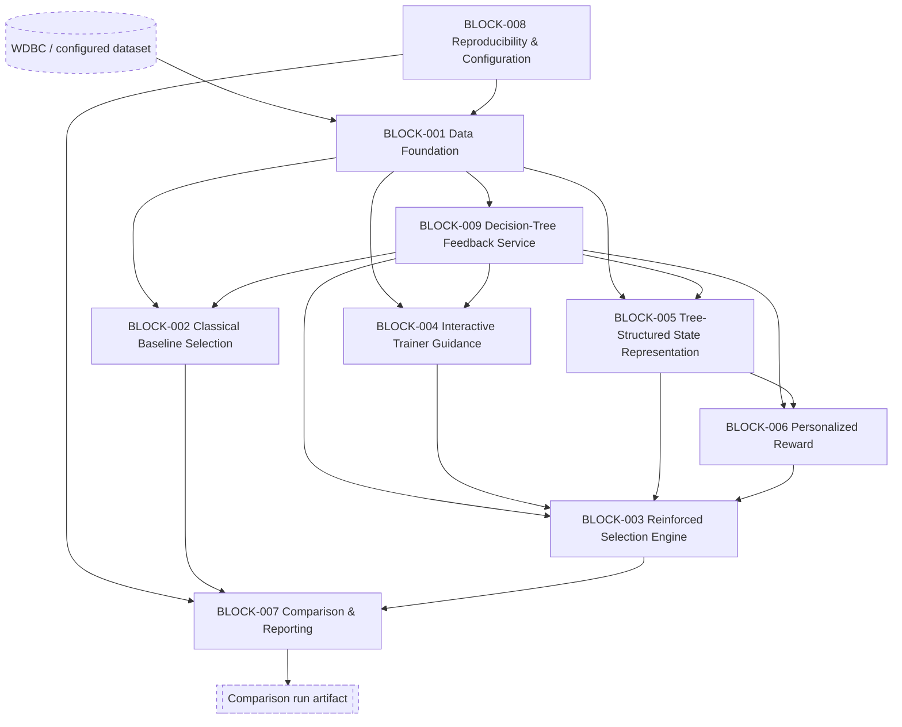
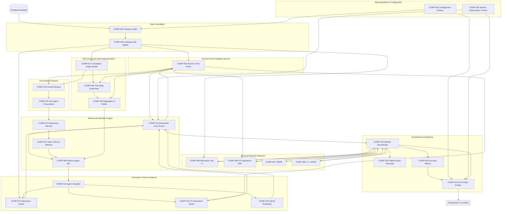

# Architecture

## Purpose

This project is a feature-selection laboratory for evaluating Interactive Reinforcement Learning Feature Selection (IRFS) against classical and reinforced baselines.

The system loads a tabular classification dataset, lets each method select a subset of features, evaluates every subset through the same downstream Decision Tree classifier, and emits one reproducible comparison artifact. The first validation target is WDBC, while the pipeline is designed to run on other binary or multiclass tabular datasets through configuration.

## Design Principles

- **Equal-footing evaluation:** every method is measured on the same split, with the same downstream classifier, through the same scoring path.
- **Leakage-safe experimentation:** the test partition is reserved for final evaluation and is not used during feature search, policy learning, reward calculation, or trainer advice.
- **One shared Decision Tree feedback service:** the Decision Tree acts both as the predictor used to score subsets and as the structural signal used by reinforced methods.
- **Trainer-agnostic reinforcement engine:** full IRFS and reinforced ablations share one engine; trainer behavior is controlled by configuration.
- **Configuration-first reproducibility:** dataset choices, hyperparameters, run sizes, metric windows, reward settings, and random seeds are centralized and recorded with run outputs.

## System Overview

The architecture is organized around a shared evaluation harness. Selection methods do not score themselves directly. Instead, each method produces a feature subset, and the common harness evaluates that subset with a shared Decision Tree probe.

The reinforced path uses one agent per feature. At each exploration step, agents decide whether to select or deselect their features, optional trainers can advise hesitant agents, a fixed-length state representation is built from correlation and tree-structure signals, and a personalized reward updates agent experience. Classical baselines bypass the RL loop but still run through the same final scoring and reporting path.

## Capability Blocks

| Block | Name | Responsibility |
|---|---|---|
| BLOCK-001 | Data Foundation | Loads configured datasets and creates leakage-safe train, validation, and test partitions. |
| BLOCK-002 | Classical Baseline Selection | Runs the four non-RL feature selectors used for comparison. |
| BLOCK-003 | Reinforced Selection Engine | Runs the multi-agent RL feature-selection loop and reinforced ablations. |
| BLOCK-004 | Interactive Trainer Guidance | Classifies agents and advises hesitant agents using relevance or Decision Tree importance. |
| BLOCK-005 | Tree-Structured State Representation | Builds fixed-length state vectors from correlation graphs and Decision Tree structure. |
| BLOCK-006 | Personalized Reward | Computes the overall reward and maps it into per-agent rewards. |
| BLOCK-007 | Comparison & Reporting | Orchestrates all methods and emits the final reproducible comparison artifact. |
| BLOCK-008 | Reproducibility & Configuration | Owns typed configuration, seed control, and deterministic run setup. |
| BLOCK-009 | Decision-Tree Feedback Service | Fits the shared downstream Decision Tree and exposes accuracy, importances, and tree structure. |

## Component Catalog

| Component | Name | One-line job |
|---|---|---|
| COMP-001 | Dataset Loader | Load a configured tabular dataset and detect feature and class counts. |
| COMP-002 | Leakage-Safe Splitter | Produce disjoint train, validation, and test partitions. |
| COMP-003 | Decision-Tree Probe | Fit a Decision Tree on a feature subset and return accuracy, importances, and tree structure. |
| COMP-004 | Accuracy Metrics | Compute Best Accuracy and Average Accuracy over a configurable window. |
| COMP-005 | Relevance Top-K Selector | Rank features by label relevance and take the top half. |
| COMP-006 | DT-Importance Recursive Eliminator | Recursively remove the least Decision-Tree-important features until half remain. |
| COMP-007 | mRMR Selector | Select features by balancing relevance and redundancy. |
| COMP-008 | L1 / LASSO Selector | Select features using non-zero L1 model coefficients. |
| COMP-009 | Feature Agent Set | Maintain one select/deselect agent per feature. |
| COMP-010 | Value Policy & Bellman Updater | Store and update value-based policies with temporal-difference learning. |
| COMP-011 | Experience Memory | Store per-agent transitions and provide training mini-batches. |
| COMP-012 | Exploration Loop Runner | Run the epsilon-greedy exploration loop and log per-step subsets and accuracy. |
| COMP-013 | Agent Classifier | Partition agents into participated, assertive, and hesitant groups. |
| COMP-014 | Relevance Trainer | Advise hesitant agents using feature relevance. |
| COMP-015 | Decision-Tree-Importance Trainer | Advise hesitant agents using Decision Tree feature importances. |
| COMP-016 | Hybrid Teaching Scheduler | Switch trainer guidance across configured step windows. |
| COMP-017 | Correlation Graph Builder | Build a feature-feature correlation graph for the selected subset. |
| COMP-018 | Tree-Edge Augmenter | Add Decision-Tree-derived directed edges to the feature graph. |
| COMP-019 | Fixed-Weight Aggregator & Pooler | Aggregate and pool graph signals into a fixed-length state vector. |
| COMP-020 | Overall Reward Calculator | Reward higher accuracy and penalize high intra-subset correlation. |
| COMP-021 | Per-Agent Reward Personalizer | Weight the overall reward per selected agent and zero deselected agents. |
| COMP-022 | Method Orchestrator | Run all configured methods on the shared split and collect their outputs. |
| COMP-023 | Run Artifact Emitter | Write configuration, selected subsets, metrics, seed, and comparison results. |
| COMP-024 | Fidelity Notes Recorder | Record implementation choices that fill gaps in or depart from the reference method. |
| COMP-025 | Configuration Surface | Expose tunable run parameters through typed configuration. |
| COMP-026 | Seed & Determinism Control | Provide the single seeded random source used by stochastic components. |

## Block View



## Runtime Flow



## Blocks

### Data Foundation

The Data Foundation loads the configured tabular dataset and produces the shared train, validation, and test partitions used throughout the run.

Its public interface is:

- `load() -> (X, y, feature_names, feature_count, class_count)`
- `split() -> train / validation / test`

The block supports binary and multiclass datasets without assuming a fixed number of features.

### Decision-Tree Feedback Service

The Decision-Tree Feedback Service owns the shared downstream classifier. Given a feature subset and evaluation partition, it fits a Decision Tree and returns:

- classification accuracy
- per-feature importances
- tree structure

This service is the system's central feedback point. Classical recursive elimination, trainer guidance, state construction, reward personalization, and reinforced exploration all consume Decision Tree output through this one interface.

### Classical Baseline Selection

This block implements the non-RL comparison methods:

- relevance-ranked top-k selection
- recursive elimination using Decision Tree importances
- mRMR selection
- L1 / LASSO-based selection

Fixed-size classical baselines select half of the available features. L1 selection may return a variable-size subset depending on which coefficients remain non-zero.

Each selector exposes a shared shape:

```text
select(train_data, k?) -> feature_subset
```

### Reinforced Selection Engine

The reinforced engine owns the multi-agent RL feature-selection loop. It maintains one agent per feature, where each agent chooses whether to select or deselect its corresponding feature.

At each step, the engine:

1. Builds or receives the current fixed-length state vector.
2. Asks feature agents for initial actions using their value policies.
3. Applies trainer advice when a trainer is active.
4. Scores the resulting subset through the shared Decision Tree probe.
5. Computes and stores per-agent experience.
6. Updates policies from sampled experience.
7. Logs the subset and accuracy for reporting.

The no-trainer MARLFS variant uses the same engine with trainer guidance disabled.

### Interactive Trainer Guidance

Trainer guidance classifies agents by action behavior and advises hesitant agents toward stronger features.

The supported trainer modes are:

- **Relevance trainer:** advises based on comparative feature relevance.
- **Decision-Tree-importance trainer:** advises based on importances from the shared Decision Tree probe.
- **Hybrid scheduler:** applies trainers in configured phases, then withdraws guidance.
- **No trainer:** leaves the reinforced engine to explore without advice.

The advice interface is:

```text
advise(prior_actions, initial_actions, training_data_or_importances, step) -> advised_actions
```

### Tree-Structured State Representation

This block encodes the selected subset into a stable state vector for feature agents.

It builds a feature-feature correlation graph from training data, augments that graph with directed edges from the Decision Tree structure, then aggregates and pools graph information into a fixed-length vector. The state dimension stays stable across steps even when the selected subset size changes.

The encoder uses fixed weights and no trained graph-network parameters.

```text
encode(selected_subset) -> fixed_length_state_vector
```

### Personalized Reward

The reward block converts subset quality into per-agent learning signals.

The overall reward favors higher downstream Decision Tree accuracy and penalizes high average correlation inside the selected subset. That overall score is then personalized for each selected agent using either Decision Tree importance or historical selection frequency. Deselected agents receive zero reward.

```text
reward(selected_subset, actions, action_history) -> per_agent_reward_vector
```

### Comparison & Reporting

The reporting block is the run-level coordinator. It executes every configured method on the shared split and downstream classifier, computes Best Accuracy and Average Accuracy for reinforced methods, and emits a single artifact containing:

- effective configuration
- dataset name/source
- seed
- selected subsets and subset sizes
- per-step metrics for reinforced methods
- final comparison table
- fidelity notes

```text
run_comparison() -> artifact_file
```

### Reproducibility & Configuration

This foundational block owns the typed configuration surface and the single seeded random source. Every stochastic component draws from this seed control layer so that repeated runs with the same configuration and seed produce the same subsets and metrics.

The configuration layer exposes dataset choices, split ratios, reinforced hyperparameters, trainer schedules, reward settings, metric windows, baseline settings, and output options.

## Core Flows

### Dataset Load and Split

The configured dataset is loaded, inspected for feature and class counts, and partitioned into train, validation, and test data. Training and validation support feature search and learning; the test partition is held for final evaluation.

### Subset Scoring

A method proposes a feature subset. The Decision-Tree probe fits a downstream classifier using that subset and returns accuracy, importances, and tree structure to the requesting component.

### Classical Baseline Selection

The orchestrator runs each classical selector on the shared training data. The recursive eliminator also uses importances from the shared Decision Tree probe. Each selector returns a feature subset to the orchestrator for common scoring and reporting.

### Reinforced Exploration

The exploration loop uses the shared seed source, current state vector, feature agents, optional trainer advice, reward personalization, and experience replay to search the feature-subset space. Each step logs the selected subset and its validation accuracy.

### State Encoding

The selected subset is represented as a graph. Correlation edges come from training-data feature values; tree edges come from the shared Decision Tree structure. Fixed-weight aggregation and pooling produce the vector consumed by feature agents.

### Reward Assignment

The reward block combines Decision Tree accuracy, Decision Tree importances, and subset correlation. It generates one reward value per agent and stores the resulting transition in experience memory for policy updates.

### Policy Update

Each feature agent samples mini-batches from stored experience and updates its value policy using temporal-difference learning.

### Comparison and Artifact Emission

After all methods complete, the orchestrator collects selected subsets and accuracy series, computes windowed metrics, and writes the final reproducible comparison artifact.

## Method Families

The architecture supports three groups of methods:

| Family | Methods |
|---|---|
| Full interactive RL | IRFS with state representation, personalized reward, and trainer guidance. |
| Reinforced ablations | No-trainer MARLFS plus trainer variants driven by the same engine. |
| Classical baselines | Relevance top-k, Decision Tree recursive elimination, mRMR, and L1 / LASSO. |

All method families converge on the same subset-scoring and reporting path.

## Output Artifact

Each comparison run produces one artifact intended to make the run reproducible and inspectable. It records what was run, how it was configured, which features each method selected, how reinforced methods evolved over time, and how the final Best and Average Accuracy metrics compare.
